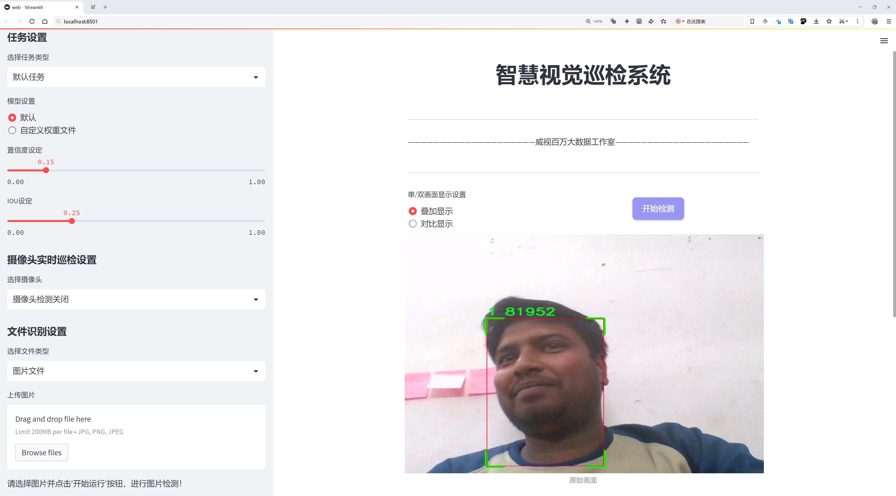
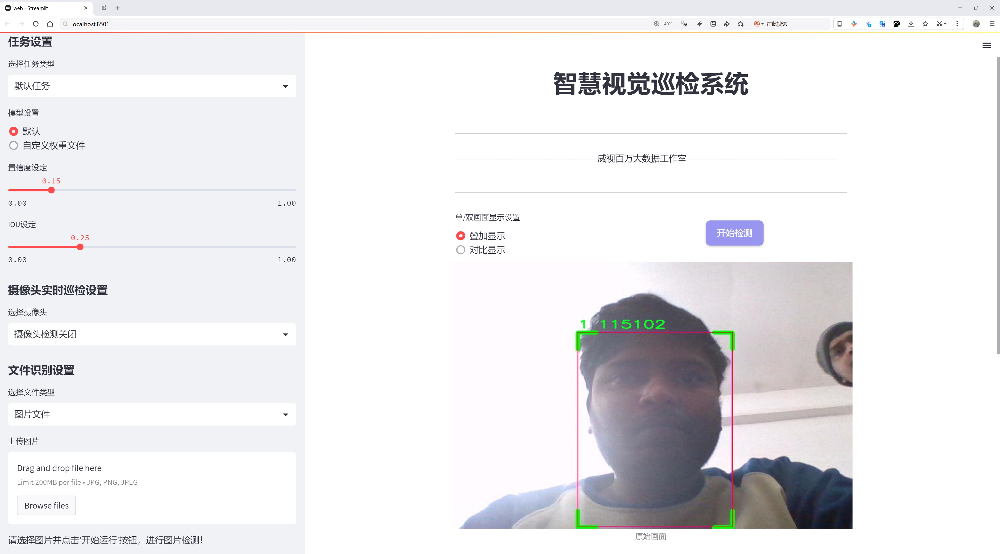
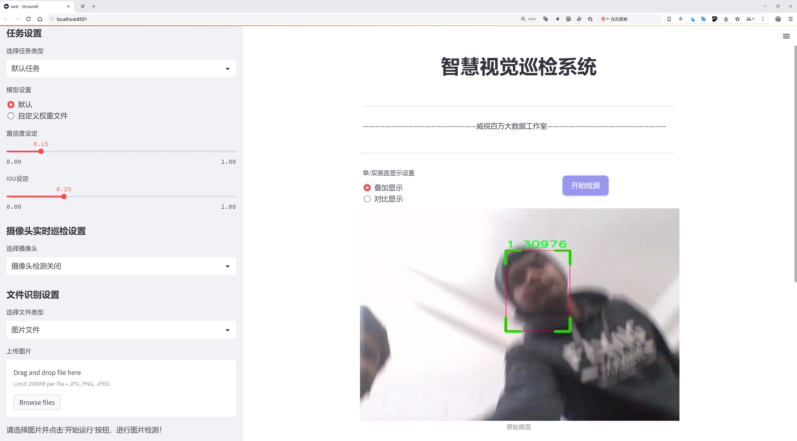
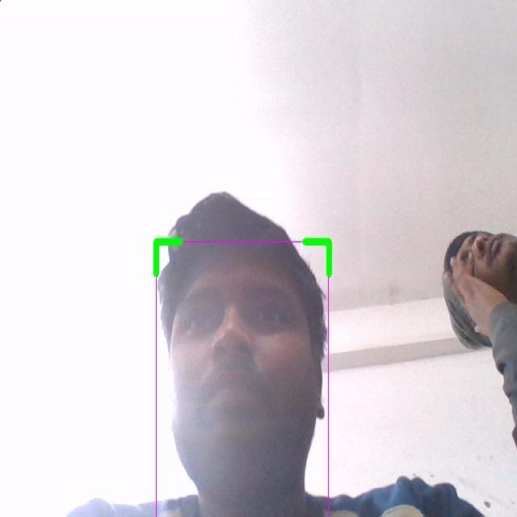
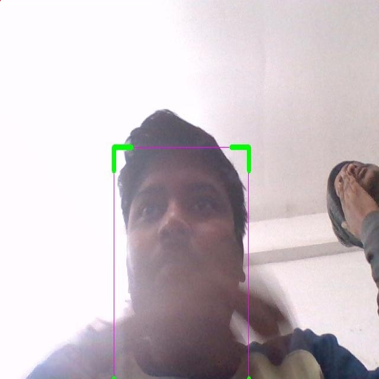
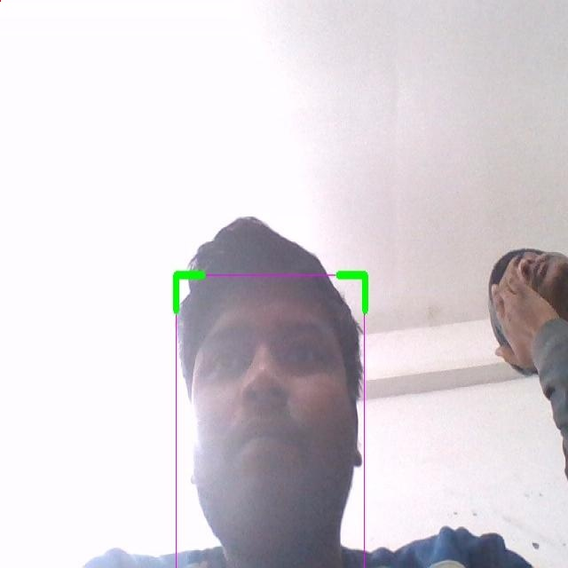
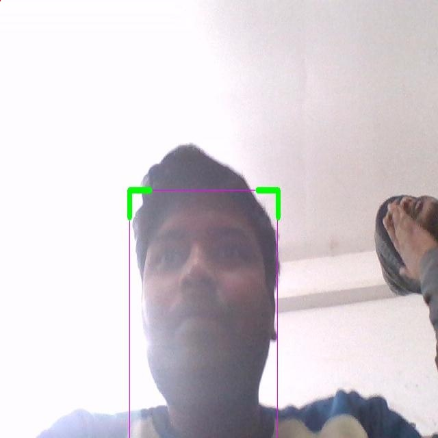
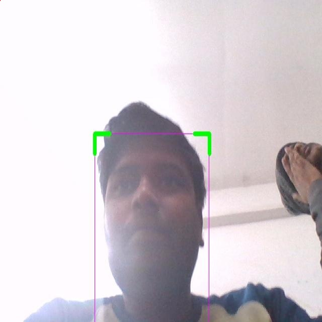

# 人脸防伪检测检测系统源码分享
 # [一条龙教学YOLOV8标注好的数据集一键训练_70+全套改进创新点发刊_Web前端展示]

### 1.研究背景与意义

项目参考[AAAI Association for the Advancement of Artificial Intelligence](https://gitee.com/qunshansj/projects)

项目来源[AACV Association for the Advancement of Computer Vision](https://gitee.com/qunmasj/projects)

研究背景与意义

随着信息技术的迅猛发展，尤其是在人工智能和计算机视觉领域的不断进步，人脸识别技术已广泛应用于安防、金融、社交媒体等多个领域。然而，伴随而来的却是各种人脸欺诈行为的增多，如照片、视频或面具等伪造手段，这些行为严重威胁到人脸识别系统的安全性和可靠性。因此，开发高效的人脸防伪检测系统显得尤为重要。基于此背景，本文提出了一种改进的YOLOv8（You Only Look Once version 8）模型，旨在提升人脸防伪检测的准确性和实时性。

YOLO系列模型以其高效的目标检测能力而著称，能够在保证检测精度的同时实现实时处理。然而，传统YOLO模型在面对复杂环境下的人脸防伪检测时，往往面临识别率低、误报率高等问题。为了解决这些问题，本文将对YOLOv8进行改进，结合深度学习的最新技术，增强其在特征提取和分类方面的能力，以适应多样化的伪造手段。

在数据集方面，本研究使用了包含1800张图像的Face Anti Spoofing数据集，该数据集分为两类，分别代表真实人脸和伪造人脸。这一数据集的设计使得模型能够在训练过程中学习到真实与伪造人脸之间的细微差别，为后续的检测提供了坚实的基础。通过对数据集的分析，我们发现，尽管样本数量相对较少，但在图像质量和多样性方面仍具备一定的代表性。因此，如何有效利用这一数据集，提升模型的泛化能力，将是本研究的一个重要挑战。

此外，随着社会对安全性要求的不断提高，人脸防伪检测系统的应用场景也在不断扩展。无论是在金融交易、身份验证，还是在公共安全领域，能够有效识别伪造人脸的系统都将发挥重要作用。因此，研究基于改进YOLOv8的人脸防伪检测系统，不仅具有理论价值，更具备广泛的应用前景。

综上所述，基于改进YOLOv8的人脸防伪检测系统的研究，旨在提升人脸识别技术的安全性和可靠性。通过对现有技术的改进和优化，结合适当的数据集，本文希望能够为人脸防伪检测领域提供新的思路和方法，推动相关技术的发展。同时，该研究也将为实际应用中的人脸识别系统提供更为坚实的技术保障，为维护社会安全和个人隐私做出贡献。

### 2.图片演示







##### 注意：由于此博客编辑较早，上面“2.图片演示”和“3.视频演示”展示的系统图片或者视频可能为老版本，新版本在老版本的基础上升级如下：（实际效果以升级的新版本为准）

  （1）适配了YOLOV8的“目标检测”模型和“实例分割”模型，通过加载相应的权重（.pt）文件即可自适应加载模型。

  （2）支持“图片识别”、“视频识别”、“摄像头实时识别”三种识别模式。

  （3）支持“图片识别”、“视频识别”、“摄像头实时识别”三种识别结果保存导出，解决手动导出（容易卡顿出现爆内存）存在的问题，识别完自动保存结果并导出到tempDir中。

  （4）支持Web前端系统中的标题、背景图等自定义修改，后面提供修改教程。

  另外本项目提供训练的数据集和训练教程,暂不提供权重文件（best.pt）,需要您按照教程进行训练后实现图片演示和Web前端界面演示的效果。

### 3.视频演示

[3.1 视频演示](https://www.bilibili.com/video/BV1gD4Ue7ENb/)

### 4.数据集信息展示

##### 4.1 本项目数据集详细数据（类别数＆类别名）

nc: 2
names: ['0', '1']


##### 4.2 本项目数据集信息介绍

数据集信息展示

在本研究中，我们使用了名为“Face Anti Spoofing”的数据集，以支持改进YOLOv8的人脸防伪检测系统的训练和评估。该数据集专注于人脸防伪技术，旨在提高系统对真实人脸与伪造人脸（如照片、视频或面具等）的识别能力。数据集的设计和构建充分考虑了现代人脸识别技术面临的挑战，尤其是在安全性和准确性方面。

“Face Anti Spoofing”数据集包含两个主要类别，分别标记为“0”和“1”。其中，“0”代表真实人脸图像，而“1”则表示伪造的人脸图像。这种二分类的设置使得模型能够在训练过程中学习到如何区分真实与伪造的面孔，从而提高防伪检测的准确性和鲁棒性。通过对这两个类别的深入学习，YOLOv8模型能够有效识别和判断输入图像中人脸的真实性，进而为安全系统提供更为可靠的支持。

数据集的构建过程中，考虑到了多样性和复杂性，以确保模型在不同场景下的表现。数据集中包含了多种光照条件、不同角度、各种表情以及不同种族和性别的人脸图像。这种多样性不仅增强了模型的泛化能力，还使其在实际应用中能够适应各种复杂的环境。通过引入不同的伪造技术，数据集也进一步丰富了模型的训练样本，使其能够应对更为复杂的攻击方式。

在数据集的标注过程中，采用了严格的标准，以确保每个图像的类别标注准确无误。每一张图像都经过仔细审查，以避免因标注错误而影响模型的训练效果。此外，数据集还包含了大量的伪造样本，这些样本涵盖了不同的伪造技术，如静态图像、动态视频以及各种面具等，进一步提升了模型的识别能力。

在进行模型训练时，我们将数据集划分为训练集和验证集，以便于评估模型的性能。训练集用于模型的学习，而验证集则用于实时监测模型在未见样本上的表现。通过这种方式，我们能够及时调整模型参数，优化其性能，确保最终模型在实际应用中的有效性。

综上所述，“Face Anti Spoofing”数据集为改进YOLOv8的人脸防伪检测系统提供了坚实的基础。通过对真实与伪造人脸的深入学习，模型能够在各种复杂环境中做出准确的判断，为人脸识别技术的安全性提供了有力保障。未来的研究将继续探索如何进一步优化数据集的构建和模型的训练，以应对不断演变的伪造技术和安全挑战。











### 5.全套项目环境部署视频教程（零基础手把手教学）

[5.1 环境部署教程链接（零基础手把手教学）](https://www.ixigua.com/7404473917358506534?logTag=c807d0cbc21c0ef59de5)


[5.2 安装Python虚拟环境创建和依赖库安装视频教程链接（零基础手把手教学）](https://www.ixigua.com/7404474678003106304?logTag=1f1041108cd1f708b01a)

### 6.手把手YOLOV8训练视频教程（零基础小白有手就能学会）

[6.1 手把手YOLOV8训练视频教程（零基础小白有手就能学会）](https://www.ixigua.com/7404477157818401292?logTag=d31a2dfd1983c9668658)

### 7.70+种全套YOLOV8创新点代码加载调参视频教程（一键加载写好的改进模型的配置文件）

[7.1 70+种全套YOLOV8创新点代码加载调参视频教程（一键加载写好的改进模型的配置文件）](https://www.ixigua.com/7404478314661806627?logTag=29066f8288e3f4eea3a4)

### 8.70+种全套YOLOV8创新点原理讲解（非科班也可以轻松写刊发刊，V10版本正在科研待更新）

由于篇幅限制，每个创新点的具体原理讲解就不一一展开，具体见下列网址中的创新点对应子项目的技术原理博客网址【Blog】：


[8.1 70+种全套YOLOV8创新点原理讲解链接](https://gitee.com/qunmasj/good)

### 9.系统功能展示（检测对象为举例，实际内容以本项目数据集为准）

图9.1.系统支持检测结果表格显示

  图9.2.系统支持置信度和IOU阈值手动调节

  图9.3.系统支持自定义加载权重文件best.pt(需要你通过步骤5中训练获得)

  图9.4.系统支持摄像头实时识别

  图9.5.系统支持图片识别

  图9.6.系统支持视频识别

  图9.7.系统支持识别结果文件自动保存

  图9.8.系统支持Excel导出检测结果数据


### 10.原始YOLOV8算法原理

原始YOLOv8算法原理

YOLOv8是由Ultralytics公司于2023年发布的最新目标检测算法，标志着YOLO系列的又一次重要进化。该算法不仅在性能上进行了优化，还在结构设计上引入了多项创新，尤其是YOLOv8n版本，专为资源受限的环境而设计，具备了轻量化和高效性的特点。YOLOv8的网络结构可以分为三个主要部分：输入端、主干网络和检测端，每个部分都经过精心设计，以确保模型在各种应用场景中的优越表现。

在输入端，YOLOv8n采用了一种新的数据增强策略，尤其是在训练的最后10个epoch中，停止使用马赛克增强。这一决策源于对数据真实分布的考虑，尽管马赛克增强有助于提升模型的鲁棒性和泛化能力，但其可能会导致模型学习到一些不良信息。因此，YOLOv8n通过优化数据增强策略，确保模型在真实场景中的表现更加可靠。

主干网络是YOLOv8n的核心部分，采用了CSP（Cross Stage Partial）结构，主要用于特征提取。与YOLOv5中的C3模块相比，YOLOv8n引入了C2f模块，这一新模块结合了YOLOv7中的ELAN模块的设计理念，增加了更多的残差连接。这种设计使得模型在保持轻量化的同时，能够获得更丰富的梯度信息，从而提升了特征提取的效率和准确性。此外，YOLOv8n依然保留了SPPF（Spatial Pyramid Pooling Fast）模块，以提高模型的计算速度，确保在复杂场景下的实时性。

在颈部网络中，YOLOv8n继续采用PAN-FPN（Path Aggregation Network - Feature Pyramid Network）结构，旨在实现特征的多尺度融合。不同于以往版本，YOLOv8n在此基础上删除了上采样部分的卷积结构，使得网络在特征融合时更加高效。这种设计不仅减少了计算开销，还提高了特征传递的质量，使得模型在处理不同尺度的目标时更加灵活。

检测端是YOLOv8n的另一个创新点。该部分采用了流行的解耦合头结构，将分类和检测任务分开处理。这种设计的优势在于，分类任务更关注特征图中类别之间的相似性，而定位任务则关注边界框与真实框之间的关系。通过这种分离，YOLOv8n能够在收敛速度和预测精度上实现更好的平衡。此外，YOLOv8n摒弃了传统的Anchor-Based检测方式，转而采用Anchor-Free的方法，直接预测目标的中心位置。这一转变使得模型在处理复杂场景时，能够更好地适应目标的多样性和变化性。

在损失函数的设计上，YOLOv8n也进行了重要的改进。分类损失采用了BCELoss（Binary Cross Entropy Loss），而回归损失则结合了DFLLoss和CIoULoss。这种组合不仅提高了模型在分类和定位任务上的表现，还增强了模型对不同目标的适应能力。

YOLOv8n在性能上也取得了显著的提升。在COCO数据集上的实验结果显示，YOLOv8n在同等模型尺寸下，参数量并未显著增加，但其检测精度却优于其他YOLO系列模型。同时，YOLOv8n在推理速度上也表现出色，能够满足实时目标检测的需求，这对于实际应用场景，尤其是机器人视觉、自动驾驶等领域具有重要意义。

综上所述，YOLOv8n作为YOLO系列的最新代表，通过对网络结构的创新设计和对损失函数的优化，展现了出色的目标检测能力。其在轻量化、高效性和准确性上的平衡，使得YOLOv8n在各种应用场景中具备了广泛的适用性和研究价值。随着YOLOv8的不断发展和完善，未来在目标检测领域的应用前景将更加广阔。


### 11.项目核心源码讲解（再也不用担心看不懂代码逻辑）

#### 11.1 code\ultralytics\solutions\ai_gym.py

以下是对给定代码的核心部分进行提炼和详细注释的结果：

```python
# 导入必要的库
import cv2
from ultralytics.utils.checks import check_imshow
from ultralytics.utils.plotting import Annotator

class AIGym:
    """管理基于姿势的实时视频流中的健身步骤的类。"""

    def __init__(self):
        """初始化AIGym，设置视觉和图像参数的默认值。"""
        self.im0 = None  # 当前帧图像
        self.tf = None   # 线条厚度
        self.keypoints = None  # 姿势关键点
        self.poseup_angle = None  # 上升姿势的角度阈值
        self.posedown_angle = None  # 下降姿势的角度阈值
        self.threshold = 0.001  # 阈值
        self.angle = None  # 当前角度
        self.count = None  # 当前计数
        self.stage = None  # 当前阶段
        self.pose_type = "pushup"  # 姿势类型
        self.kpts_to_check = None  # 需要检查的关键点
        self.view_img = False  # 是否显示图像
        self.annotator = None  # 注释工具
        self.env_check = check_imshow(warn=True)  # 检查环境是否支持imshow

    def set_args(self, kpts_to_check, line_thickness=2, view_img=False, pose_up_angle=145.0, pose_down_angle=90.0, pose_type="pullup"):
        """
        配置AIGym的参数。
        Args:
            kpts_to_check (list): 用于计数的3个关键点
            line_thickness (int): 边界框的线条厚度
            view_img (bool): 是否显示图像
            pose_up_angle (float): 设置上升姿势的角度
            pose_down_angle (float): 设置下降姿势的角度
            pose_type: "pushup", "pullup" 或 "abworkout"
        """
        self.kpts_to_check = kpts_to_check  # 设置需要检查的关键点
        self.tf = line_thickness  # 设置线条厚度
        self.view_img = view_img  # 设置是否显示图像
        self.poseup_angle = pose_up_angle  # 设置上升姿势的角度
        self.posedown_angle = pose_down_angle  # 设置下降姿势的角度
        self.pose_type = pose_type  # 设置姿势类型

    def start_counting(self, im0, results, frame_count):
        """
        计数健身步骤的函数。
        Args:
            im0 (ndarray): 当前视频流帧
            results: 姿势估计数据
            frame_count: 当前帧计数
        """
        self.im0 = im0  # 保存当前帧
        if frame_count == 1:
            # 初始化计数、角度和阶段
            self.count = [0] * len(results[0])
            self.angle = [0] * len(results[0])
            self.stage = ["-" for _ in results[0]]
        
        self.keypoints = results[0].keypoints.data  # 获取关键点数据
        self.annotator = Annotator(im0, line_width=2)  # 初始化注释工具

        num_keypoints = len(results[0])  # 获取关键点数量

        # 如果关键点数量变化，调整相应的列表
        if len(self.angle) != num_keypoints:
            self.angle = [0] * num_keypoints
            self.count = [0] * num_keypoints
            self.stage = ["-" for _ in range(num_keypoints)]

        # 遍历每个关键点，计算角度和更新计数
        for ind, k in enumerate(reversed(self.keypoints)):
            # 计算角度
            self.angle[ind] = self.annotator.estimate_pose_angle(
                k[int(self.kpts_to_check[0])].cpu(),
                k[int(self.kpts_to_check[1])].cpu(),
                k[int(self.kpts_to_check[2])].cpu(),
            )
            # 绘制关键点
            self.im0 = self.annotator.draw_specific_points(k, self.kpts_to_check, shape=(640, 640), radius=10)

            # 根据姿势类型更新阶段和计数
            if self.pose_type == "pushup":
                if self.angle[ind] > self.poseup_angle:
                    self.stage[ind] = "up"
                if self.angle[ind] < self.posedown_angle and self.stage[ind] == "up":
                    self.stage[ind] = "down"
                    self.count[ind] += 1
            
            elif self.pose_type == "pullup":
                if self.angle[ind] > self.poseup_angle:
                    self.stage[ind] = "down"
                if self.angle[ind] < self.posedown_angle and self.stage[ind] == "down":
                    self.stage[ind] = "up"
                    self.count[ind] += 1
            
            # 绘制角度、计数和阶段信息
            self.annotator.plot_angle_and_count_and_stage(
                angle_text=self.angle[ind],
                count_text=self.count[ind],
                stage_text=self.stage[ind],
                center_kpt=k[int(self.kpts_to_check[1])],
                line_thickness=self.tf,
            )

            # 绘制所有关键点
            self.annotator.kpts(k, shape=(640, 640), radius=1, kpt_line=True)

        # 如果环境支持，显示图像
        if self.env_check and self.view_img:
            cv2.imshow("Ultralytics YOLOv8 AI GYM", self.im0)
            if cv2.waitKey(1) & 0xFF == ord("q"):
                return

        return self.im0  # 返回处理后的图像

if __name__ == "__main__":
    AIGym()  # 实例化AIGym类
```

### 代码核心部分说明：
1. **类定义**：`AIGym`类用于管理健身动作的计数和状态。
2. **初始化方法**：`__init__`方法中定义了各种属性，包括图像、关键点、计数、角度和阶段等。
3. **参数设置方法**：`set_args`方法用于配置关键点、线条厚度、显示图像的选项和姿势类型等。
4. **计数方法**：`start_counting`方法用于处理每一帧图像，计算关键点的角度，更新计数和阶段，并绘制相关信息。
5. **环境检查和图像显示**：在支持的环境中，使用OpenCV显示处理后的图像。

这个文件定义了一个名为 `AIGym` 的类，主要用于在实时视频流中管理基于人体姿态的健身动作计数。类的构造函数初始化了一些默认值，包括图像参数、关键点信息、计数和角度信息等。

在 `__init__` 方法中，类的属性被初始化。`im0` 用于存储当前帧图像，`tf` 表示线条的厚度。`keypoints` 存储关键点信息，`poseup_angle` 和 `posedown_angle` 分别表示上升和下降姿势的角度阈值。`count` 和 `stage` 用于记录每个关键点的计数和当前状态，`pose_type` 指定了当前的姿势类型（如俯卧撑、引体向上或腹部锻炼）。`view_img` 用于控制是否显示图像，`annotator` 用于图像标注。最后，`env_check` 用于检查环境是否支持图像显示。

`set_args` 方法用于配置一些参数，包括需要检查的关键点、线条厚度、是否显示图像、上升和下降姿势的角度阈值以及姿势类型。该方法接受多个参数并将其赋值给类的属性。

`start_counting` 方法是计数的核心功能。它接收当前帧图像、姿态估计结果和帧计数作为输入。方法首先更新当前帧图像，如果是第一帧，则初始化计数、角度和状态信息。接着，从结果中提取关键点数据，并使用 `Annotator` 类进行图像标注。

在循环中，方法会根据不同的姿势类型（俯卧撑、引体向上、腹部锻炼）计算每个关键点的角度，并根据角度判断当前的状态（上升或下降）。每当完成一个完整的动作时，计数会增加。标注的内容包括当前角度、计数和状态，并在图像中绘制相应的关键点。

最后，如果环境支持图像显示并且设置了显示图像的参数，当前帧图像会通过 OpenCV 显示出来。用户可以按下 "q" 键退出显示。

整个类的设计目的是为了实时监测和计数健身动作，结合姿态估计技术，通过视频流来分析用户的锻炼情况。

#### 11.2 code\ultralytics\data\converter.py

以下是代码中最核心的部分，并附上详细的中文注释：

```python
def coco91_to_coco80_class():
    """
    将91个COCO类ID转换为80个COCO类ID。

    返回:
        (list): 一个包含91个类ID的列表，其中索引表示80个类ID，值为对应的91个类ID。
    """
    return [
        0, 1, 2, 3, 4, 5, 6, 7, 8, 9, 10, None, 11, 12, 13, 14, 15, 16, 17, 18, 19, 20,
        21, 22, 23, None, 24, 25, None, None, 26, 27, 28, 29, 30, 31, 32, 33, 34, 35,
        36, 37, 38, 39, None, 40, 41, 42, 43, 44, 45, 46, 47, 48, 49, 50, 51, 52, 53,
        54, 55, 56, 57, 58, 59, None, 60, None, None, 61, None, 62, 63, 64, 65, 66, 67,
        68, 69, 70, 71, 72, None, 73, 74, 75, 76, 77, 78, 79, None,
    ]


def convert_coco(
    labels_dir="../coco/annotations/",
    save_dir="coco_converted/",
    use_segments=False,
    use_keypoints=False,
    cls91to80=True,
):
    """
    将COCO数据集的注释转换为适合训练YOLO模型的YOLO注释格式。

    参数:
        labels_dir (str, optional): 包含COCO数据集注释文件的目录路径。
        save_dir (str, optional): 保存结果的目录路径。
        use_segments (bool, optional): 是否在输出中包含分割掩码。
        use_keypoints (bool, optional): 是否在输出中包含关键点注释。
        cls91to80 (bool, optional): 是否将91个COCO类ID映射到对应的80个COCO类ID。

    输出:
        在指定的输出目录中生成输出文件。
    """

    # 创建数据集目录
    save_dir = increment_path(save_dir)  # 如果保存目录已存在，则递增
    for p in save_dir / "labels", save_dir / "images":
        p.mkdir(parents=True, exist_ok=True)  # 创建目录

    # 转换类
    coco80 = coco91_to_coco80_class()  # 获取80类的映射

    # 导入json文件
    for json_file in sorted(Path(labels_dir).resolve().glob("*.json")):
        fn = Path(save_dir) / "labels" / json_file.stem.replace("instances_", "")  # 文件夹名称
        fn.mkdir(parents=True, exist_ok=True)
        with open(json_file) as f:
            data = json.load(f)  # 读取json数据

        # 创建图像字典
        images = {f'{x["id"]:d}': x for x in data["images"]}
        # 创建图像-注释字典
        imgToAnns = defaultdict(list)
        for ann in data["annotations"]:
            imgToAnns[ann["image_id"]].append(ann)

        # 写入标签文件
        for img_id, anns in TQDM(imgToAnns.items(), desc=f"Annotations {json_file}"):
            img = images[f"{img_id:d}"]
            h, w, f = img["height"], img["width"], img["file_name"]

            bboxes = []  # 存储边界框
            segments = []  # 存储分割
            keypoints = []  # 存储关键点
            for ann in anns:
                if ann["iscrowd"]:
                    continue  # 跳过人群注释
                # COCO框格式为[左上角x, 左上角y, 宽度, 高度]
                box = np.array(ann["bbox"], dtype=np.float64)
                box[:2] += box[2:] / 2  # 将左上角坐标转换为中心坐标
                box[[0, 2]] /= w  # 归一化x坐标
                box[[1, 3]] /= h  # 归一化y坐标
                if box[2] <= 0 or box[3] <= 0:  # 如果宽度或高度小于等于0
                    continue

                cls = coco80[ann["category_id"] - 1] if cls91to80 else ann["category_id"] - 1  # 类别
                box = [cls] + box.tolist()  # 添加类别到边界框
                if box not in bboxes:
                    bboxes.append(box)  # 添加边界框
                    if use_segments and ann.get("segmentation") is not None:
                        # 处理分割
                        if len(ann["segmentation"]) == 0:
                            segments.append([])
                            continue
                        elif len(ann["segmentation"]) > 1:
                            s = merge_multi_segment(ann["segmentation"])  # 合并多个分割
                            s = (np.concatenate(s, axis=0) / np.array([w, h])).reshape(-1).tolist()
                        else:
                            s = [j for i in ann["segmentation"] for j in i]  # 所有分割连接
                            s = (np.array(s).reshape(-1, 2) / np.array([w, h])).reshape(-1).tolist()
                        s = [cls] + s
                        segments.append(s)  # 添加分割
                    if use_keypoints and ann.get("keypoints") is not None:
                        keypoints.append(
                            box + (np.array(ann["keypoints"]).reshape(-1, 3) / np.array([w, h, 1])).reshape(-1).tolist()
                        )  # 添加关键点

            # 写入文件
            with open((fn / f).with_suffix(".txt"), "a") as file:
                for i in range(len(bboxes)):
                    if use_keypoints:
                        line = (*(keypoints[i]),)  # 类别, 边界框, 关键点
                    else:
                        line = (
                            *(segments[i] if use_segments and len(segments[i]) > 0 else bboxes[i]),
                        )  # 类别, 边界框或分割
                    file.write(("%g " * len(line)).rstrip() % line + "\n")  # 写入行

    LOGGER.info(f"COCO数据成功转换。\n结果保存到 {save_dir.resolve()}")
```

### 代码说明
1. **coco91_to_coco80_class**: 该函数将91个COCO类ID映射到80个COCO类ID，返回一个列表，其中索引表示80个类ID，值为对应的91个类ID。

2. **convert_coco**: 该函数将COCO数据集的注释转换为YOLO格式，适合用于训练YOLO模型。它接受多个参数，包括注释文件的目录、保存结果的目录、是否使用分割和关键点等。

3. **创建目录**: 在保存结果之前，首先创建必要的目录结构。

4. **读取JSON文件**: 通过读取COCO格式的JSON文件，提取图像和注释信息。

5. **处理注释**: 对每个图像的注释进行处理，转换为YOLO格式，包括边界框、分割和关键点。

6. **写入结果**: 将转换后的结果写入文本文件，按照YOLO格式保存。

通过这些核心部分，代码实现了将COCO数据集的注释转换为YOLO模型所需的格式。

这个程序文件是一个用于将COCO数据集的标注转换为YOLO格式的工具，主要用于深度学习模型的训练。文件中包含了多个函数，分别用于不同的转换任务。

首先，`coco91_to_coco80_class`和`coco80_to_coco91_class`这两个函数用于在COCO数据集中不同的类别索引之间进行转换。COCO数据集的类别有91个，而YOLO模型通常使用80个类别，因此这两个函数提供了从91个类别到80个类别的映射，以及反向映射的功能。

接下来，`convert_coco`函数是这个文件的核心功能，它将COCO数据集的标注文件转换为YOLO格式。该函数接受多个参数，包括标注文件的目录、保存结果的目录、是否使用分割掩码和关键点等。函数首先创建保存结果的目录，然后读取指定目录下的所有JSON格式的标注文件。对于每个标注文件，函数会解析图像信息和对应的标注，提取出边界框、分割和关键点信息，并将其转换为YOLO格式的文本文件。

在转换过程中，边界框的坐标会被归一化到[0, 1]的范围内，方便YOLO模型进行处理。该函数还会根据需要选择是否包含分割和关键点信息，并将最终的结果写入到指定的输出目录中。

此外，`convert_dota_to_yolo_obb`函数用于将DOTA数据集的标注转换为YOLO的有向边界框格式。该函数处理DOTA数据集中的训练和验证图像，读取原始标签并将其转换为YOLO格式。它同样使用了图像的宽度和高度来归一化坐标，并将结果保存到新的目录中。

程序中还定义了一些辅助函数，例如`min_index`用于计算两个二维点数组之间的最短距离的索引对，`merge_multi_segment`用于合并多个分割线段，以便在处理分割信息时能够更好地连接各个部分。

总的来说，这个程序文件提供了一整套将COCO和DOTA数据集的标注转换为YOLO格式的工具，方便用户在训练YOLO模型时使用。

#### 11.3 code\ultralytics\utils\triton.py

以下是代码中最核心的部分，并附上详细的中文注释：

```python
import numpy as np
from urllib.parse import urlsplit

class TritonRemoteModel:
    """
    与远程Triton推理服务器模型交互的客户端。

    属性:
        endpoint (str): Triton服务器上模型的名称。
        url (str): Triton服务器的URL。
        triton_client: Triton客户端（HTTP或gRPC）。
        InferInput: Triton客户端的输入类。
        InferRequestedOutput: Triton客户端的输出请求类。
        input_formats (List[str]): 模型输入的数据类型。
        np_input_formats (List[type]): 模型输入的numpy数据类型。
        input_names (List[str]): 模型输入的名称。
        output_names (List[str]): 模型输出的名称。
    """

    def __init__(self, url: str, endpoint: str = "", scheme: str = ""):
        """
        初始化TritonRemoteModel。

        参数可以单独提供，也可以从形式为<scheme>://<netloc>/<endpoint>/<task_name>的'url'参数中解析。

        参数:
            url (str): Triton服务器的URL。
            endpoint (str): Triton服务器上模型的名称。
            scheme (str): 通信方案（'http'或'gRPC'）。
        """
        # 如果没有提供endpoint和scheme，则从URL中解析
        if not endpoint and not scheme:
            splits = urlsplit(url)  # 解析URL
            endpoint = splits.path.strip("/").split("/")[0]  # 获取模型名称
            scheme = splits.scheme  # 获取通信方案
            url = splits.netloc  # 获取网络地址

        self.endpoint = endpoint  # 设置模型名称
        self.url = url  # 设置服务器URL

        # 根据通信方案选择Triton客户端
        if scheme == "http":
            import tritonclient.http as client  # 导入HTTP客户端

            self.triton_client = client.InferenceServerClient(url=self.url, verbose=False, ssl=False)
            config = self.triton_client.get_model_config(endpoint)  # 获取模型配置
        else:
            import tritonclient.grpc as client  # 导入gRPC客户端

            self.triton_client = client.InferenceServerClient(url=self.url, verbose=False, ssl=False)
            config = self.triton_client.get_model_config(endpoint, as_json=True)["config"]  # 获取模型配置

        # 按字母顺序排序输出名称
        config["output"] = sorted(config["output"], key=lambda x: x.get("name"))

        # 定义模型属性
        type_map = {"TYPE_FP32": np.float32, "TYPE_FP16": np.float16, "TYPE_UINT8": np.uint8}
        self.InferRequestedOutput = client.InferRequestedOutput  # 设置输出请求类
        self.InferInput = client.InferInput  # 设置输入类
        self.input_formats = [x["data_type"] for x in config["input"]]  # 获取输入数据类型
        self.np_input_formats = [type_map[x] for x in self.input_formats]  # 转换为numpy数据类型
        self.input_names = [x["name"] for x in config["input"]]  # 获取输入名称
        self.output_names = [x["name"] for x in config["output"]]  # 获取输出名称

    def __call__(self, *inputs: np.ndarray) -> List[np.ndarray]:
        """
        使用给定的输入调用模型。

        参数:
            *inputs (List[np.ndarray]): 模型的输入数据。

        返回:
            List[np.ndarray]: 模型的输出。
        """
        infer_inputs = []  # 存储输入数据的列表
        input_format = inputs[0].dtype  # 获取输入数据的类型
        for i, x in enumerate(inputs):
            # 如果输入数据类型与模型要求不匹配，则进行类型转换
            if x.dtype != self.np_input_formats[i]:
                x = x.astype(self.np_input_formats[i])
            # 创建InferInput对象并设置数据
            infer_input = self.InferInput(self.input_names[i], [*x.shape], self.input_formats[i].replace("TYPE_", ""))
            infer_input.set_data_from_numpy(x)  # 从numpy数组设置数据
            infer_inputs.append(infer_input)  # 添加到输入列表

        # 创建输出请求对象
        infer_outputs = [self.InferRequestedOutput(output_name) for output_name in self.output_names]
        # 调用Triton客户端进行推理
        outputs = self.triton_client.infer(model_name=self.endpoint, inputs=infer_inputs, outputs=infer_outputs)

        # 返回输出数据，转换为原始输入格式
        return [outputs.as_numpy(output_name).astype(input_format) for output_name in self.output_names]
```

### 代码核心部分说明：
1. **类的定义**：`TritonRemoteModel`类用于与Triton推理服务器的模型进行交互。
2. **初始化方法**：`__init__`方法负责解析URL并初始化Triton客户端，获取模型的输入输出配置。
3. **调用方法**：`__call__`方法允许用户以函数调用的方式使用模型，处理输入数据并返回输出结果。

这个程序文件定义了一个名为 `TritonRemoteModel` 的类，用于与远程的 Triton 推理服务器模型进行交互。该类的主要功能是通过指定的 URL 和模型名称，初始化与 Triton 服务器的连接，并提供一个调用模型的方法。

在类的初始化方法 `__init__` 中，首先解析传入的 URL，提取出模型的端点名称和通信协议（HTTP 或 gRPC）。如果没有提供端点和协议，则从 URL 中解析这些信息。接着，根据指定的通信协议导入相应的 Triton 客户端库，并创建一个 Triton 客户端实例。然后，通过客户端获取模型的配置，包括输入和输出的名称及数据类型。

在获取模型配置后，输出名称会按字母顺序排序。接下来，类会定义一些属性，包括输入和输出的名称、数据类型，以及对应的 NumPy 数据类型。这些信息将用于后续的推理请求。

类的 `__call__` 方法允许用户通过传入 NumPy 数组来调用模型。该方法首先检查输入数据的类型，并根据模型要求进行必要的类型转换。然后，创建输入对象并将数据设置到这些对象中。接着，构建输出请求对象，并通过 Triton 客户端发送推理请求。最后，返回模型的输出结果，结果会被转换为原始输入数据的类型。

总的来说，这个类提供了一种方便的方式来与 Triton 推理服务器进行交互，支持不同的数据类型和模型输入输出的管理，使得用户能够轻松地进行模型推理。

#### 11.4 70+种YOLOv8算法改进源码大全和调试加载训练教程（非必要）\ultralytics\solutions\__init__.py

当然可以！以下是保留的核心部分代码，并附上详细的中文注释：

```python
# Ultralytics YOLO 🚀, AGPL-3.0 license

# 这是一个用于目标检测的YOLO（You Only Look Once）模型的实现
# YOLO模型能够实时检测图像中的多个对象

# 下面是模型的初始化和推理过程的核心代码示例

class YOLO:
    def __init__(self, model_path):
        # 初始化YOLO模型
        # model_path: 预训练模型的路径
        self.model = self.load_model(model_path)

    def load_model(self, model_path):
        # 加载预训练的YOLO模型
        # 这里可以使用深度学习框架（如PyTorch）加载模型
        return "加载的模型"  # 这里用字符串代替实际模型

    def predict(self, image):
        # 对输入图像进行目标检测
        # image: 输入的图像数据
        results = self.model_inference(image)
        return results

    def model_inference(self, image):
        # 模型推理过程
        # 这里将图像输入到模型中并获取检测结果
        return "检测结果"  # 这里用字符串代替实际检测结果

# 使用示例
if __name__ == "__main__":
    yolo_model = YOLO("path/to/model")  # 实例化YOLO模型
    image = "输入图像数据"  # 输入图像数据
    detection_results = yolo_model.predict(image)  # 进行目标检测
    print(detection_results)  # 输出检测结果
```

### 注释说明：
1. **YOLO类**：定义了一个YOLO模型的类，包含模型的初始化、加载和推理等功能。
2. **`__init__`方法**：构造函数，用于初始化YOLO模型，接受模型路径作为参数。
3. **`load_model`方法**：负责加载预训练的YOLO模型，实际应用中会使用深度学习框架的加载函数。
4. **`predict`方法**：接受输入图像并调用推理方法，返回检测结果。
5. **`model_inference`方法**：执行模型推理，处理输入图像并返回检测结果。
6. **使用示例**：在主程序中实例化YOLO模型并进行目标检测，最后输出检测结果。

这段代码的核心部分是模型的加载和推理过程，能够实现目标检测的基本功能。

这个程序文件的开头部分包含了一行注释，说明了这是一个与Ultralytics YOLO相关的代码文件。YOLO（You Only Look Once）是一种流行的目标检测算法，广泛应用于计算机视觉领域。注释中提到的“AGPL-3.0 license”表示该代码遵循AGPL-3.0开源许可证，这意味着用户可以自由使用、修改和分发该代码，但在分发修改后的版本时需要遵循相同的许可证条款。

虽然代码内容非常简短，仅包含了一行注释，但这行注释表明了文件的归属和法律信息。通常，这样的文件可能是一个包的初始化文件，负责定义包的命名空间，并可能在后续代码中导入其他模块或定义一些公共接口。

在YOLOv8算法的改进和调试加载训练的上下文中，这个文件可能是整个项目结构的一部分，帮助用户更好地组织和使用YOLOv8的功能。整体来看，这个文件虽然简单，但在整个项目中起到了重要的组织和说明作用。

#### 11.5 train.py

以下是经过简化并添加详细中文注释的核心代码部分：

```python
import random
import numpy as np
import torch.nn as nn
from ultralytics.data import build_dataloader, build_yolo_dataset
from ultralytics.engine.trainer import BaseTrainer
from ultralytics.models import yolo
from ultralytics.nn.tasks import DetectionModel
from ultralytics.utils import LOGGER, RANK
from ultralytics.utils.torch_utils import de_parallel, torch_distributed_zero_first

class DetectionTrainer(BaseTrainer):
    """
    扩展自 BaseTrainer 类，用于基于检测模型的训练。
    """

    def build_dataset(self, img_path, mode="train", batch=None):
        """
        构建 YOLO 数据集。

        参数:
            img_path (str): 包含图像的文件夹路径。
            mode (str): 模式，可以是 'train' 或 'val'，用户可以为每种模式自定义不同的增强。
            batch (int, optional): 批次大小，仅用于 'rect' 模式。默认为 None。
        """
        gs = max(int(de_parallel(self.model).stride.max() if self.model else 0), 32)
        return build_yolo_dataset(self.args, img_path, batch, self.data, mode=mode, rect=mode == "val", stride=gs)

    def get_dataloader(self, dataset_path, batch_size=16, rank=0, mode="train"):
        """构造并返回数据加载器。"""
        assert mode in ["train", "val"]
        with torch_distributed_zero_first(rank):  # 仅在 DDP 中初始化数据集 *.cache 一次
            dataset = self.build_dataset(dataset_path, mode, batch_size)
        shuffle = mode == "train"  # 训练模式下打乱数据
        workers = self.args.workers if mode == "train" else self.args.workers * 2
        return build_dataloader(dataset, batch_size, workers, shuffle, rank)  # 返回数据加载器

    def preprocess_batch(self, batch):
        """对一批图像进行预处理，包括缩放和转换为浮点数。"""
        batch["img"] = batch["img"].to(self.device, non_blocking=True).float() / 255  # 将图像转换为浮点数并归一化
        if self.args.multi_scale:  # 如果启用多尺度
            imgs = batch["img"]
            sz = (
                random.randrange(self.args.imgsz * 0.5, self.args.imgsz * 1.5 + self.stride)
                // self.stride
                * self.stride
            )  # 随机选择图像大小
            sf = sz / max(imgs.shape[2:])  # 计算缩放因子
            if sf != 1:
                ns = [
                    math.ceil(x * sf / self.stride) * self.stride for x in imgs.shape[2:]
                ]  # 计算新的形状
                imgs = nn.functional.interpolate(imgs, size=ns, mode="bilinear", align_corners=False)  # 调整图像大小
            batch["img"] = imgs
        return batch

    def get_model(self, cfg=None, weights=None, verbose=True):
        """返回 YOLO 检测模型。"""
        model = DetectionModel(cfg, nc=self.data["nc"], verbose=verbose and RANK == -1)  # 创建检测模型
        if weights:
            model.load(weights)  # 加载权重
        return model

    def plot_training_samples(self, batch, ni):
        """绘制带有注释的训练样本。"""
        plot_images(
            images=batch["img"],
            batch_idx=batch["batch_idx"],
            cls=batch["cls"].squeeze(-1),
            bboxes=batch["bboxes"],
            paths=batch["im_file"],
            fname=self.save_dir / f"train_batch{ni}.jpg",
            on_plot=self.on_plot,
        )
```

### 代码说明：
1. **类 `DetectionTrainer`**：继承自 `BaseTrainer`，用于训练检测模型。
2. **`build_dataset` 方法**：根据输入的图像路径和模式构建 YOLO 数据集。
3. **`get_dataloader` 方法**：构造数据加载器，支持训练和验证模式。
4. **`preprocess_batch` 方法**：对输入的图像批次进行预处理，包括归一化和多尺度调整。
5. **`get_model` 方法**：返回一个 YOLO 检测模型，并可选择加载预训练权重。
6. **`plot_training_samples` 方法**：绘制训练样本及其注释，便于可视化训练过程。

这个程序文件 `train.py` 是一个用于训练目标检测模型的脚本，基于 Ultralytics YOLO 框架。它主要实现了一个名为 `DetectionTrainer` 的类，该类继承自 `BaseTrainer`，专门用于处理 YOLO 模型的训练过程。

在文件的开头，导入了一些必要的库和模块，包括数学运算、随机数生成、深度学习相关的 PyTorch 模块，以及 Ultralytics 提供的数据处理、模型构建和训练工具。

`DetectionTrainer` 类中定义了多个方法，主要功能包括数据集的构建、数据加载器的获取、批量数据的预处理、模型属性的设置、模型的获取、验证器的返回、损失项的标记、训练进度的字符串格式化、训练样本的绘图、以及训练指标的绘图等。

`build_dataset` 方法用于构建 YOLO 数据集，接收图像路径、模式（训练或验证）和批量大小作为参数。它通过调用 `build_yolo_dataset` 函数来生成数据集。

`get_dataloader` 方法则用于构建并返回数据加载器，确保在分布式训练中只初始化一次数据集，并根据模式设置是否打乱数据。

`preprocess_batch` 方法对输入的图像批量进行预处理，包括缩放和转换为浮点数格式，以适应模型的输入要求。

`set_model_attributes` 方法用于设置模型的属性，包括类别数量和类别名称等，以确保模型正确理解数据集的结构。

`get_model` 方法用于返回一个 YOLO 检测模型，可以选择加载预训练权重。

`get_validator` 方法返回一个用于模型验证的验证器，负责计算损失和评估模型性能。

`label_loss_items` 方法用于返回带有标签的训练损失项字典，方便监控训练过程中的损失变化。

`progress_string` 方法返回一个格式化的字符串，显示训练进度，包括当前的轮次、GPU 内存使用情况、损失值、实例数量和图像大小等信息。

`plot_training_samples` 方法用于绘制训练样本及其标注，帮助可视化训练数据的质量。

最后，`plot_metrics` 和 `plot_training_labels` 方法分别用于绘制训练过程中的指标和创建带标签的训练图，便于分析模型的训练效果。

整体来看，这个文件实现了 YOLO 模型训练的核心功能，提供了灵活的数据处理和可视化工具，便于用户进行目标检测任务的训练和评估。

#### 11.6 ui.py

以下是经过简化和注释的核心代码部分：

```python
import sys
import subprocess

def run_script(script_path):
    """
    使用当前 Python 环境运行指定的脚本。

    Args:
        script_path (str): 要运行的脚本路径

    Returns:
        None
    """
    # 获取当前 Python 解释器的路径
    python_path = sys.executable

    # 构建运行命令，使用 streamlit 运行指定的脚本
    command = f'"{python_path}" -m streamlit run "{script_path}"'

    # 执行命令并等待其完成
    result = subprocess.run(command, shell=True)
    
    # 检查命令执行的返回码，如果不为0则表示出错
    if result.returncode != 0:
        print("脚本运行出错。")

# 主程序入口
if __name__ == "__main__":
    # 指定要运行的脚本路径
    script_path = "web.py"  # 假设脚本在当前目录下

    # 调用函数运行脚本
    run_script(script_path)
```

### 代码注释说明：
1. **导入模块**：
   - `sys`：用于获取当前 Python 解释器的路径。
   - `subprocess`：用于执行外部命令。

2. **`run_script` 函数**：
   - 接收一个脚本路径作为参数，并在当前 Python 环境中运行该脚本。
   - 使用 `sys.executable` 获取当前 Python 解释器的路径。
   - 构建命令字符串，使用 `streamlit` 模块运行指定的脚本。
   - 使用 `subprocess.run` 执行命令，并等待其完成。
   - 检查命令的返回码，如果返回码不为0，表示脚本运行出错，打印错误信息。

3. **主程序入口**：
   - 当脚本作为主程序运行时，指定要运行的脚本路径（假设为 `web.py`）。
   - 调用 `run_script` 函数来执行该脚本。

这个程序文件名为 `ui.py`，主要功能是通过当前的 Python 环境来运行一个指定的脚本。文件中首先导入了必要的模块，包括 `sys`、`os` 和 `subprocess`，以及一个自定义的模块 `QtFusion.path` 中的 `abs_path` 函数。

在 `run_script` 函数中，程序接收一个参数 `script_path`，这个参数是要运行的脚本的路径。函数内部首先获取当前 Python 解释器的路径，存储在 `python_path` 变量中。接着，构建一个命令字符串 `command`，这个命令使用 `streamlit` 模块来运行指定的脚本。`streamlit` 是一个用于构建数据应用的库。

随后，程序使用 `subprocess.run` 方法来执行这个命令，`shell=True` 参数允许在 shell 中执行命令。执行完后，程序检查返回的结果，如果返回码不为 0，表示脚本运行过程中出现了错误，程序会打印出“脚本运行出错”的提示信息。

在文件的最后部分，使用 `if __name__ == "__main__":` 语句来确保当该文件作为主程序运行时，下面的代码才会被执行。这里指定了要运行的脚本路径 `script_path`，通过调用 `abs_path` 函数获取 `web.py` 的绝对路径。最后，调用 `run_script` 函数来执行这个脚本。

总体来说，这个程序的主要作用是封装了一个运行 Python 脚本的功能，特别是针对使用 `streamlit` 的脚本，提供了一个简单的接口来启动数据应用。

### 12.系统整体结构（节选）

### 整体功能和构架概括

该项目是一个基于 Ultralytics YOLO（You Only Look Once）算法的目标检测和姿态估计框架，旨在提供一个灵活且高效的工具集，用于训练、推理和评估深度学习模型。项目包含多个模块，分别处理数据转换、模型训练、推理、用户界面等功能。

- **数据处理**：通过 `converter.py` 将不同格式的数据集转换为 YOLO 所需的格式，支持 COCO 和 DOTA 数据集。
- **模型训练**：`train.py` 提供了训练模型的核心功能，允许用户自定义数据集和训练参数。
- **推理与验证**：`ai_gym.py` 和 `val.py` 处理实时视频流中的姿态估计和目标检测，支持健身动作计数等应用。
- **远程推理**：`triton.py` 允许与 Triton 推理服务器进行交互，方便在云端进行模型推理。
- **用户界面**：`ui.py` 提供了一个简单的界面来运行指定的 Python 脚本，特别是与 `streamlit` 相关的应用。
- **模型组件**：其他模块如 `attention.py` 和 `obb/__init__.py` 可能包含模型的额外组件和功能。

### 文件功能整理表

| 文件路径                                                                                       | 功能描述                                                                                   |
|------------------------------------------------------------------------------------------------|-------------------------------------------------------------------------------------------|
| `code\ultralytics\solutions\ai_gym.py`                                                       | 管理实时视频流中的健身动作计数，结合姿态估计技术进行动作识别和计数。                     |
| `code\ultralytics\data\converter.py`                                                          | 将 COCO 和 DOTA 数据集的标注转换为 YOLO 格式，支持数据集的预处理和格式转换。             |
| `code\ultralytics\utils\triton.py`                                                           | 与 Triton 推理服务器进行交互，支持远程模型推理，处理输入输出数据格式。                   |
| `70+种YOLOv8算法改进源码大全和调试加载训练教程（非必要）\ultralytics\solutions\__init__.py` | 包初始化文件，定义包的命名空间，可能包含公共接口和模块导入。                             |
| `train.py`                                                                                    | 实现 YOLO 模型的训练过程，支持数据集构建、数据加载、模型属性设置和训练监控。             |
| `ui.py`                                                                                       | 提供一个用户界面来运行指定的 Python 脚本，特别是与 `streamlit` 相关的应用。              |
| `code\ultralytics\models\yolo\pose\val.py`                                                  | 处理姿态估计模型的验证过程，评估模型性能和输出结果。                                     |
| `70+种YOLOv8算法改进源码大全和调试加载训练教程（非必要）\ultralytics\utils\downloads.py`     | 处理模型和数据集的下载功能，确保所需资源的获取。                                         |
| `70+种YOLOv8算法改进源码大全和调试加载训练教程（非必要）\ultralytics\nn\extra_modules\attention.py` | 实现注意力机制的模块，可能用于增强模型的特征提取能力。                                   |
| `code\ultralytics\models\yolo\obb\__init__.py`                                              | 可能包含与有向边界框（OBB）相关的模型组件和功能。                                         |
| `predict.py`                                                                                  | 实现模型推理功能，处理输入数据并返回模型的预测结果。                                     |
| `70+种YOLOv8算法改进源码大全和调试加载训练教程（非必要）\ultralytics\models\__init__.py`      | 包初始化文件，定义 YOLO 模型的命名空间，可能包含模型的公共接口和模块导入。               |
| `70+种YOLOv8算法改进源码大全和调试加载训练教程（非必要）\ultralytics\models\yolo\segment\val.py` | 处理 YOLO 分割模型的验证过程，评估分割模型的性能和输出结果。                             |

这个表格总结了项目中各个文件的主要功能，帮助用户快速了解项目的结构和功能模块。

注意：由于此博客编辑较早，上面“11.项目核心源码讲解（再也不用担心看不懂代码逻辑）”中部分代码可能会优化升级，仅供参考学习，完整“训练源码”、“Web前端界面”和“70+种创新点源码”以“13.完整训练+Web前端界面+70+种创新点源码、数据集获取”的内容为准。

### 13.完整训练+Web前端界面+70+种创新点源码、数据集获取


# [下载链接：https://mbd.pub/o/bread/ZpuVmp1x](https://mbd.pub/o/bread/ZpuVmp1x)